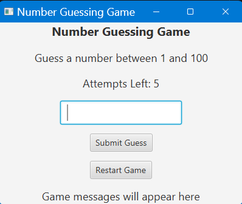
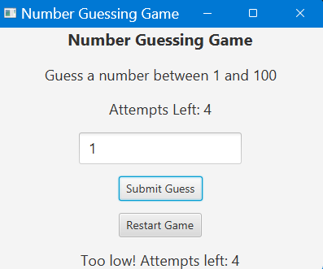
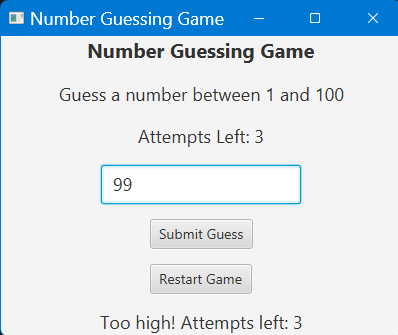
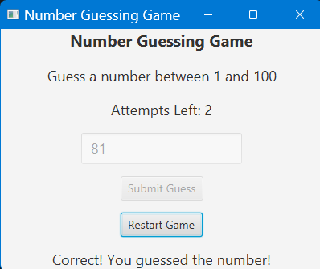
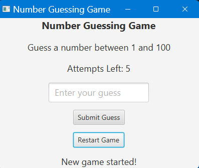
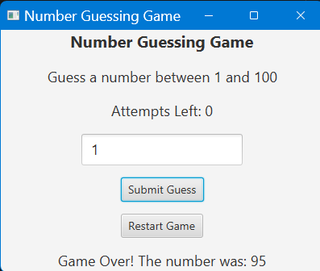

# Number Guessing Game

A beginner-friendly Java desktop application built using JavaFX.

This game generates a random number between 1 and 100, and the player must guess the correct number within limited attempts.

---

# Features

- Random number generation
- JavaFX graphical user interface
- Guess comparison logic
- High / Low feedback messages
- Attempt tracking
- Game Over handling
- Restart game functionality
- Input validation
- Exception handling
- Dynamic UI updates
- JUnit testing support

---

# Technologies Used

- Java 17
- JavaFX
- Maven
- JUnit 5
- IntelliJ IDEA
- Git & GitHub

---

# How to Run the Project

## Run Using Maven

```bash
mvn javafx:run
```

---

## Build Executable JAR

```bash
mvn clean package
```

---

## Run Packaged JAR

```bash
java --module-path "C:\Program Files\javafx-sdk-17.0.19\lib" --add-modules javafx.controls,javafx.fxml -jar number-guessing-game-1.0-SNAPSHOT.jar
```

---

# Running Tests

```bash
mvn test
```

---

# Screenshot

### Home


### Attempt Low


### Attempt Low


### Attempt Low


### Restart


### Game Over



---

## Author

[Prathamesh Kakde](https://github.com/prathameshkakde)

---

> ## Note
> This project idea is inspired by an [article](https://www.geeksforgeeks.org/blogs/java-projects/#:~:text=4.%20Number%20Guessing%20Game) from [GeeksforGeeks](https://www.geeksforgeeks.org/) and showcases the following key concepts:
> * Java’s Random class and control structures.
> * Create a basic GUI with JavaFX.
> * Handle user input and game logic.

---